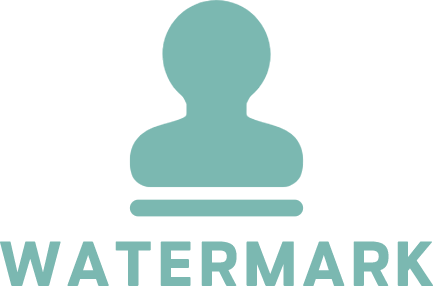

<p align="center">

</p>

vue3 水印组件 | vue3 watermark component

Lightweight, flexible watermark component for Vue 3. Supports text or image watermarks, rotation, DPI-aware rendering, theme-aware colors, and reactive updates.

## Install

```sh
npm i @simon_he/vue-watermark
```

## Usage

Using script setup in SFC:

```vue
<script setup lang="ts">
import { WaterMark } from '@simon_he/vue-watermark'

// optional: dynamic values
const rotation = -30
const logo = 'https://example.com/logo.png' // or inline SVG string, or HTMLImageElement
</script>

<template>
  <WaterMark
    text="vue-watermark"
    :rotation="rotation"
    :gap="20"
    :font-size="40"
    color="auto"
    auto-color-dark="rgba(255,255,255,0.35)"
    auto-color-light="rgba(0,0,0,0.3)"
  >
    <!-- your main content -->
  </WaterMark>
</template>
```

Or with an image/icon watermark:

```vue
<template>
  <WaterMark :image="logo" :image-scale="0.6" :rotation="-45">
    <div>content...</div>
  </WaterMark>
  <!-- You can also use kebab-case tag name -->
  <!-- <water-mark :image="logo" /> -->
</template>
```

Color options:

- color="auto" (default): Automatically chooses light/dark color based on `.dark` class on `html/body` or system preference `prefers-color-scheme`.
- Provide explicit color, including CSS variables: `color="var(--wm-color, rgba(0,0,0,0.3))"`.
- Customize auto colors:

```vue
<WaterMark
  color="auto"
  auto-color-dark="rgba(255,255,255,0.35)"
  auto-color-light="rgba(0,0,0,0.3)"
/>
```

Props summary:

- text: string = 'watermark'
- fontSize: number = 40
- gap: number = 20
- rotation: number = -45
- image: string | HTMLImageElement = '' (URL, data URL, inline SVG string, or preloaded Image)
- imageScale: number = 0.6 (relative max dimension of image inside tile)
- color: string = 'auto' (supports CSS variables via var(--name[, fallback]))
- autoColorDark: string = 'rgba(255,255,255,0.35)'
- autoColorLight: string = 'rgba(0,0,0,0.3)'
- styles: string = '' (inline styles appended to overlay, e.g. custom z-index)

Notes:

- CORS: when using remote images, ensure they allow cross-origin access or use data URLs/inline SVG to avoid a tainted canvas.
- The watermark overlay is non-interactive (`pointer-events: none`) and marked `aria-hidden` for accessibility.
- SSR: canvas operations are guarded; they only run in the browser.

## License

[MIT](./LICENSE) License © 2022 [Simon He](https://github.com/Simon-He95)

<a href="https://github.com/Simon-He95/sponsor" target="_blank"></a>

<span><div align="center"></div></span>
